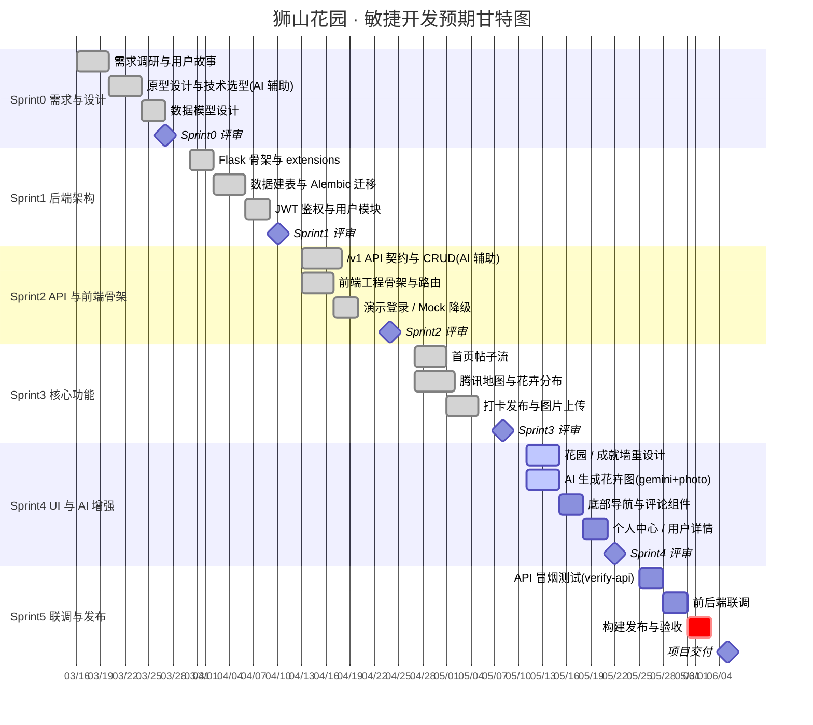

# 狮山花园 · 敏捷开发预期甘特图

本项目采用 **敏捷开发**模式：技术栈经历多次重构试错（Java → Node → Flask）、使用 AI 生成花卉图片、AI 辅助 API 契约对齐与文档/测试脚本编写，呈现持续迭代的敏捷节奏。

下图按 **Sprint 迭代**分组，每个 Sprint 固定 2 周，末尾设评审里程碑。

## 图例说明

| 状态 | 含义 |
|------|------|
| `done`（灰色） | 已完成的任务 |
| `active`（高亮） | 进行中的任务 |
| `crit`（红色） | 关键路径任务 |
| `milestone`（菱形节点） | Sprint 评审 / 交付里程碑 |

## 板块对照（各 Sprint 融入的工作板块）

- **① 需求与设计**：需求调研、原型、技术选型、数据模型（User / Flower / Place / FlowerPlace / Checkin / Achievement / Title）
- **② 后端开发**：Flask 骨架、`extensions.py` 解循环依赖、`/v1` API 契约、JWT、文件上传、`seed_demo_data.py`
- **③ 前端开发**：登录 / 首页 / 地图(腾讯) / 打卡 / 花园成就 / 个人中心 / 用户详情、底部导航、`CommentSheet`
- **④ AI 辅助**：AI 生成花卉图（`gemini+photo`）、AI 辅助代码重构与 API 对齐、AI 写测试脚本与文档
- **⑤ 测试与联调**：`verify-api.sh` 冒烟测试、前后端联调、Mock 降级策略
- **⑥ 评审与发布**：Sprint Review 里程碑、构建发布、验收

## 渲染与导出

- 在 GitHub 预览、Typora、VS Code（Markdown Preview Mermaid Support 插件）中可直接渲染。
- 导出图片：`mmdc -i doc/甘特图.md -o 甘特图.png`（需安装 `@mermaid-js/mermaid-cli`）。
