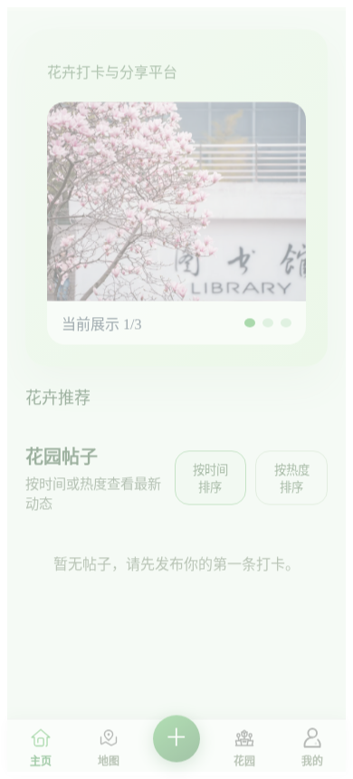
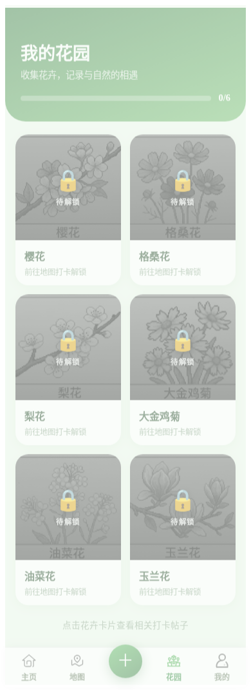
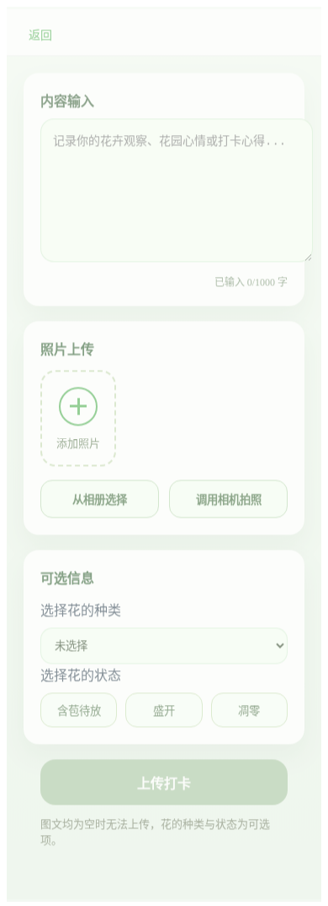

# 狮山花园 · 自动化测试调研与学习总结

> 本文档记录本次"自动化测试软件调研 + 实战"的全过程：从工具调研、环境搭建、用例设计，到实际对团队项目「狮山花园」的**登录与底部导航**功能进行端到端（E2E）自动化测试，并附测试结果与学习心得。
>
> - 被测对象：狮山花园前端（Vue 3 + Vite，默认端口 `5173`）
> - 测试工具：**Playwright**（v1.60）
> - 测试范围：登录页渲染、演示模式登录、底部导航跳转、页签激活态、路由守卫
> - 测试结果：**5 条用例全部通过（5 passed，耗时 ~13s）**

---

## 一、自动化测试调研

### 1.1 什么是自动化测试

自动化测试是用脚本/工具代替人工，自动执行预先编排的测试用例并自动判定结果（断言）的过程。相较手工测试，它的价值在于：

- **可重复**：每次代码改动都能一键回归，避免"改 A 坏 B"。
- **高效率**：几十条用例几秒到几分钟跑完，远快于人工点击。
- **可沉淀**：用例即文档，明确描述了"系统应有的行为"。
- **可集成**：能接入 CI/CD，在每次提交时自动拦截回归缺陷。

按层次通常分为：单元测试（函数/组件级）、集成测试（模块间）、**端到端测试（E2E，从用户视角驱动真实浏览器走完整流程）**。本项目是一个 H5 Web 应用，核心价值体现在"用户能否顺畅地登录并在各页面间导航"，因此选择 **E2E 测试** 最贴合验证目标。

### 1.2 主流 Web 自动化测试工具对比

| 工具 | 类型 | 语言 | 浏览器驱动 | 等待机制 | 上手难度 | 适配本项目 |
|------|------|------|-----------|---------|---------|-----------|
| **Playwright** | E2E | TS/JS、Python、Java、.NET | 内置 Chromium/Firefox/WebKit | **自动等待**（auto-wait） | 低 | ⭐⭐⭐⭐⭐ |
| Selenium | E2E | 多语言 | 需自行匹配 WebDriver | 需手写显式/隐式等待 | 中 | ⭐⭐⭐ |
| Cypress | E2E | JS/TS | 主要 Chromium 系 | 自动重试 | 低 | ⭐⭐⭐⭐ |

### 1.3 为什么选择 Playwright

1. **与项目技术栈天然契合**：本项目是 Vue 3 + Node 生态，Playwright 用 TypeScript 编写用例，与前端同语言、同工具链（npm/vite），零额外语言环境。
2. **自动等待，告别 `sleep`**：Playwright 在每个操作前自动等待元素可见、可交互，SPA（单页应用）路由切换、异步渲染场景下几乎不需要手写等待，用例更稳定。
3. **开箱即用的证据链**：内置截图、录屏、Trace（可回放的操作时间线）与 HTML 报告，"记录测试过程与结果"这一作业要求被原生满足。
4. **可自动托管开发服务器**：通过 `webServer` 配置，测试启动时自动拉起 `npm run dev`，无需人工预先开服务，复现成本极低。
5. **浏览器自带**：`npx playwright install` 一键下载所需内核，无需像 Selenium 那样单独维护与浏览器版本匹配的 driver。

---

## 二、环境与安装

### 2.1 环境要求

- Node.js：`^20.19.0 || >=22.12.0`（本机实测 `v20.20.2`）
- 包管理器：npm 10.x
- 操作系统：Linux（Windows/macOS 同样适用）

### 2.2 安装步骤

```bash
# 1. 进入前端目录
cd Frontend

# 2. 安装 Playwright 测试库（本项目已有 vite 版本 peer 冲突，加 --legacy-peer-deps 规避）
npm install -D @playwright/test --legacy-peer-deps

# 3. 下载浏览器内核（仅装 Chromium 以节省体积/时间）
npx playwright install chromium
```

### 2.3 配置文件 `Frontend/playwright.config.ts`

核心配置说明：

```ts
export default defineConfig({
  testDir: './tests/e2e',                       // 用例目录
  reporter: [['list'], ['html', { ... }]],      // 命令行 + HTML 报告
  use: {
    baseURL: 'http://localhost:5173',           // 被测前端地址
    locale: 'zh-CN',                            // 中文环境
    screenshot: 'on',                           // 始终截图留证
    video: 'retain-on-failure',                 // 失败录屏
    viewport: { width: 390, height: 844 },      // 移动端 H5 视口
  },
  webServer: {                                  // 测试自动拉起 vite dev server
    command: 'npm run dev',
    url: 'http://localhost:5173',
    reuseExistingServer: true,
  },
})
```

并在 `package.json` 增加脚本：

```json
"test:e2e": "playwright test",
"test:e2e:ui": "playwright test --ui",
"test:e2e:report": "playwright show-report"
```

> 说明：本项目前端带 **mock 数据降级**——当后端请求失败时自动回退到本地假数据，因此整套 E2E 测试**无需启动 Flask 后端**即可运行，进一步降低了测试的环境依赖。

---

## 三、被测功能与测试设计

### 3.1 被测流程

```
打开应用 (/)  ──重定向──▶  登录页 (/login)
        │  点击「演示模式」
        ▼
     首页 (/home)  ──底部导航──▶  地图 /map · 花园 /garden · 我的 /profile · 打卡 /checkin
```

涉及的关键源码与选择器（均取自实际代码，未改动业务）：

| 元素 | 来源文件 | 选择器 |
|------|---------|--------|
| 演示登录按钮 | `src/views/login.vue` | `button.demo-login-btn`（文本"演示模式"） |
| 底部导航项 | `src/components/BottomNav.vue` | `.nav-item`（主页/地图/花园/我的）、激活态 `.nav-item.active` |
| 中间发布按钮 | `src/components/BottomNav.vue` | `button.add-btn` → `/checkin` |
| 路由守卫 | `src/router.ts` | 读取 `localStorage.getItem('token')`；演示登录写入 `demo_token_<时间戳>` |

### 3.2 测试用例清单

| 编号 | 用例名称 | 关键步骤 | 预期结果 |
|------|---------|---------|---------|
| TC01 | 登录页正确渲染 | 访问 `/` | 重定向到 `/login`；"狮山花园""演示模式"可见 |
| TC02 | 演示模式登录 | 点击 `button.demo-login-btn` | 跳转 `/home`；`localStorage.token` 以 `demo_token_` 开头；首页关键文本可见 |
| TC03 | 底部导航跳转 | 依次点击 地图/花园/我的/＋/主页 | URL 与各页面锚点（`#map-panel`、"我的花园"、`.profile-page`、`.checkin-page`）逐一匹配 |
| TC04 | 页签激活态 | 首页 / 切到花园 | 当前页签命中 `.nav-item.active` 且文本对应 |
| TC05 | 路由守卫（反例） | 清空 token 后直接访问 `/garden` | 被重定向回 `/login` |

---

## 四、测试过程

### 4.1 执行命令

```bash
cd Frontend
npm run test:e2e
```

执行时 Playwright 自动完成：① 启动 vite dev server → ② 启动 Chromium → ③ 按顺序执行 5 条用例并截图 → ④ 生成 HTML 报告。

### 4.2 用例代码节选（`tests/e2e/login-nav.spec.ts`）

公共登录步骤：

```ts
async function demoLogin(page: Page) {
  await page.goto('/')
  await page.locator('button.demo-login-btn').click()
  await page.waitForURL('**/home')
}
```

TC02 — 演示登录并校验 token 落地：

```ts
test('TC02 演示模式登录成功并进入首页', async ({ page }) => {
  await page.goto('/')
  await page.locator('button.demo-login-btn').click()
  await expect(page).toHaveURL(/\/home$/)
  const token = await page.evaluate(() => localStorage.getItem('token'))
  expect(token).toMatch(/^demo_token_/)
  await expect(page.getByText('花卉打卡与分享平台')).toBeVisible()
})
```

TC05 — 路由守卫反例：

```ts
test('TC05 路由守卫：未登录访问受保护页面被重定向到登录页', async ({ page }) => {
  await page.goto('/')
  await page.evaluate(() => localStorage.clear())
  await page.goto('/garden')
  await expect(page).toHaveURL(/\/login$/)
})
```

---

## 五、测试结果

### 5.1 命令行输出

```
Running 5 tests using 1 worker

  ✓  1 …TC01 登录页正确渲染 (1.3s)
  ✓  2 …TC02 演示模式登录成功并进入首页 (1.6s)
  ✓  3 …TC03 底部导航在各页面间正确跳转 (3.3s)
  ✓  4 …TC04 当前页签呈激活态 (2.0s)
  ✓  5 …TC05 路由守卫：未登录访问受保护页面被重定向到登录页 (1.2s)

  5 passed (13.2s)
```

| 指标 | 结果 |
|------|------|
| 用例总数 | 5 |
| 通过 | **5** |
| 失败 | 0 |
| 通过率 | **100%** |
| 总耗时 | 约 13.2s |

可通过 `npm run test:e2e:report` 打开交互式 HTML 报告，查看每条用例的步骤、截图与 Trace。

### 5.2 测试截图

**TC01 登录页：** 根路径成功重定向至登录页，标题"狮山花园"与"演示模式"按钮正确渲染。


**TC02 首页：** 演示登录后跳转至首页，"花卉打卡与分享平台""花卉推荐""花园帖子"内容齐备，底部导航就位。



**TC03 地图 / 花园 / 打卡：** 底部导航跳转正常，各页面关键锚点存在。

| 地图 | 花园 | 打卡 |
|------|------|------|
|  |  |  |

**TC05 路由守卫：** 清空登录态后直接访问受保护的 `/garden`，被正确拦截并重定向回登录页。


> 备注：本轮测试一次性全部通过，无失败用例需修复。设计阶段已先行核对真实源码中的选择器（如 `button.demo-login-btn`、`#map-panel`、`.hero-title`），避免了"选择器与实际 DOM 不符"的常见返工。

---

## 六、学习总结

### 6.1 Playwright 的优点与不足

**优点：**
- **自动等待**显著提升 SPA 测试稳定性，几乎无需手写 `sleep`/轮询。
- 断言、定位 API（`getByRole` / `getByText` / `locator`）语义清晰、可读性强。
- 截图、录屏、Trace、HTML 报告**原生内置**，证据链完整，非常契合"记录过程与结果"。
- `webServer` 自动托管 dev server，复现门槛低。

**不足 / 注意点：**
- 首次需下载浏览器内核（约百 MB 级），离线环境需提前准备。
- 在依赖树有 peer 冲突的老项目里安装需 `--legacy-peer-deps` 等手段规避。
- E2E 测试相对"重"，不适合替代细粒度的单元测试，二者应分层互补。

### 6.2 本项目实践中的几点体会（踩坑记录）

1. **选择器要"以代码为准"**：动手写用例前先读 `login.vue`、`BottomNav.vue`、`router.ts`，用真实的 class/文本作定位依据，比凭直觉猜测稳得多。
2. **理解被测系统的"状态依赖"**：路由守卫依据 `localStorage.token` 判定登录态；演示登录通过 `api.setToken()` 把 token 写入 `localStorage`（`api.ts:84`）。摸清这条链路后，TC02 校验 token、TC05 清空 token 的反例才能精准设计。
3. **善用 mock 降级**：本项目前端在后端不可用时回退到 mock 数据，使 E2E 可在"纯前端"下稳定运行，是设计自动化测试时值得借鉴的可测试性思路。
4. **中文环境**：通过 `locale: 'zh-CN'` 与按中文文本定位，验证了 Playwright 对中文 UI 的良好支持。

### 6.3 后续可扩展方向

- **扩大覆盖**：补充打卡发布（表单输入、字数统计、提交）、点赞/评论、用户详情等流程。
- **接入 CI**：在 GitHub Actions 等流水线中于每次提交自动运行，实现持续回归。
- **分层测试**：引入 Vitest 做组件/工具函数的单元测试，与 E2E 形成测试金字塔。
- **数据驱动**：对接真实后端（对齐 `/v1` 与 `/api` 路径差异后）做更贴近生产的端到端验证。

---

## 附录：交付物清单

| 文件 | 说明 |
|------|------|
| `Frontend/playwright.config.ts` | Playwright 配置（含自动托管 dev server） |
| `Frontend/tests/e2e/login-nav.spec.ts` | 5 条 E2E 测试用例 |
| `Frontend/tests/e2e/screenshots/` | 各用例运行截图 |
| `Frontend/playwright-report/` | 交互式 HTML 测试报告（`npm run test:e2e:report` 打开） |
| `doc/test-img/` | 本文档引用的截图副本 |
| `doc/自动化测试学习总结.md` | 本调研与学习总结文档 |
